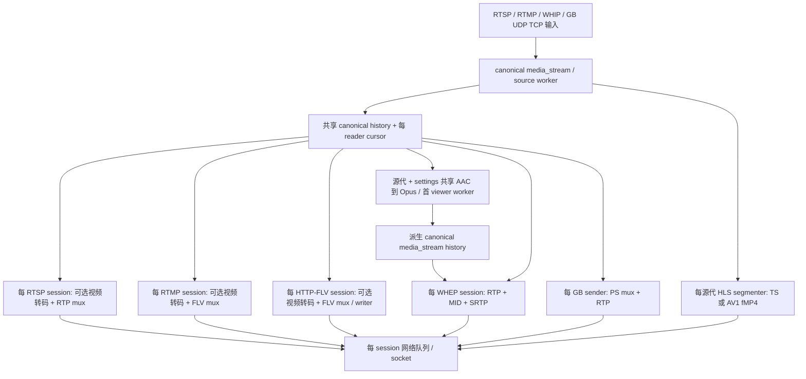
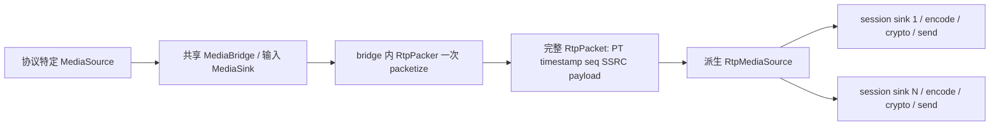
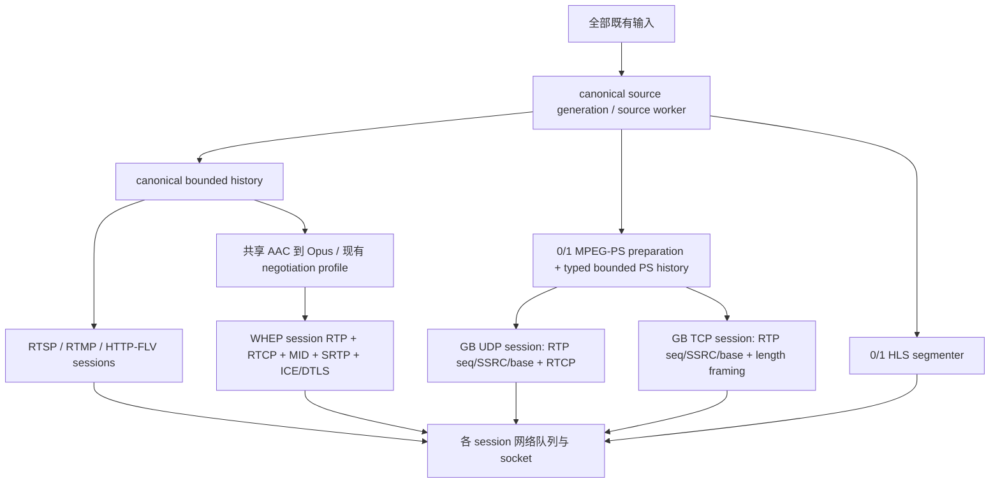

# 输出媒体准备审计与实施记录

## 基线与范围

2026-09-25 开始，分支 `main`，HEAD 与 `origin/main` 均为
`707ca60afc5c38a455272d61de8a54f3775a7394`。工作区无修改，唯一 worktree
为 `/home/gyl/example/media_server`。参考项目 `/home/gyl/data/code/mms-server`
只读。所有提交仅本地，禁止 push。

目标是共享同一 source generation 中确定的媒体准备，保持 canonical 的
H264/H265 Annex-B complete AU、AAC ADTS、Opus、G711A/U，不建立协议桥接矩阵。
现有 AV1 输出选项继续支持。stream_name 是资源标识，stream_id 来自外部。

## 当前架构

`media/core/media_stream.cpp` 的 publisher 不等待 reader；history 保留最近 GOP
（关键帧切换时可含前一 GOP），每 GOP 至多 2500 entries，保留量至多两个这样的 GOP。batch 最多 128 entries。
reader 单 outstanding read，落后后可从当前关键帧重同步。batch 共享 payload，
不复制媒体字节。请求 dispatch 到 source worker，回调 post 到 reader worker。

## 逐输出 inventory

下列分配/拷贝为代码静态下界，不能当成实测 CPU 百分比。F 为帧大小，K 为分片数，
N 为 session 数。source history 及 track snapshot 共享；网络状态均按 session。

| 输出 | codec transform | mux/container | packetization | session/control | queue/socket | 重复成本 |
|---|---|---|---|---|---|---|
| RTSP | passthrough；AV1 选项按 session 转码 | 每 session rtsp_muxer | 每 frame NAL scan、RTP fragments | PT、seq、SSRC、timestamp、RTCP、interleaved channels | TCP 队列，半高线暂停 reader | N×scan(F)，K 次 interleaved vector 分配/复制 |
| RTMP | passthrough；AV1 按 session 转码 | 每 session FLV/AVCC mux | 每 session RTMP chunk | RTMP timestamp/control/chunk state | TCP 队列，半高线暂停 reader | N×Annex-B scan/AVCC copy；RTMP header+payload 连续 buffer |
| HTTP-FLV | 同 RTMP | 每 session FLV mux + tag writer | HTTP chunk | bootstrap generation、写完成状态 | 一个普通 write in progress | N×scan/FLV copy，writer fragments 合并一次 |
| HLS | passthrough；AV1 每源代转码 | 每源代 TS/fMP4 segmenter | 每 segment | playlist/play admission/inactivity | HTTP 持有 immutable segment buffer | 已共享；TS 输出追加与 segment retention 是源成本 |
| WHEP | AAC→Opus 已按源代/settings 共享；AV1 按 viewer | RTP muxer 每 session | 每 frame NAL scan/FU；每包 MID 重建 | 协商、seq、SSRC、timestamp、RTCP、ICE/DTLS/SRTP | 每 session UDP queue/socket | N×scan/FU，MID vector + RTP vector + SRTP copy/encrypt |
| GB UDP | 无 codec 转码 | 每 sender PS mux | 每 sender PS RTP fragmentation | PT/SSRC/seq/timestamp、RTCP | UDP datagram queue，满时丢包 | N×PS/PES/pack/system/PSM；RTP payload copy + callback vector copy |
| GB TCP | 无 codec 转码 | 每 sender PS mux | 同 UDP + 2-byte length prefix | PT/SSRC/seq/timestamp、TCP control | TCP write queue，满时终止 | 同 UDP，另一次 length-prefixed buffer 分配/复制 |

定位：`rtsp_play_session.cpp:133,509,638`；`rtmp_play_session.cpp:115`；
`flv_muxer.cpp:160,194`；`http_flv_streamer.cpp:77,172`；
`hls.cpp:64`、`hls_segmenter.cpp:124,259,702`；
`webrtc_packetizer.cpp:119,192,441`、`srtp_transport.cpp:130`；
`gb28181_rtp_sender.cpp:69,106,195`、UDP session `:264`、TCP session `:200`。
行号对应初始基线。

输入到普通输出有 source→session worker delivery；HLS mux 在 source callback 内。
AAC egress 额外经过 source→首 viewer worker→viewer worker。
现存性能文档是 2026-09-19 的旧基线，其中一些 WHEP 和 HLS 结论已过期，不能
代替本轮 control。用户提供的 950/1050/1075 WHEP 数据是后续正式比较的背景值。

## 参考项目

`live-server/bridge/rtmp/rtmp_to_rtsp.cpp:267,365,458` 调一次 pack；
`libs/protocol/rtp/rtp_packer.cpp:26,71` 填完整 header 并复制 payload；
`live-server/core/rtp_media_source.cpp:34` 向所有 sink 传同一批 shared_ptr；
`rtp_media_sink.cpp:15` 只回调。RTSP/WebRTC session encode 后发送，WebRTC 单独 SRTP。
这些路径确实共享 PT、timestamp、seq、SSRC 和 payload，部分 bridge 传入 SSRC=0。

借鉴单次准备、多消费者持有 immutable bytes。拒绝 N×M BridgeFactory 字符串转换矩阵、
协议特定 canonical source、完整 RTP header 的跨 session 共享、每 sink 媒体发送队列
替代本项目 bounded history/cursor。参考项目的 timer/sink close 生命周期也不照搬。

## 共享矩阵与协议依据

| 内容 | 共享粒度 | 必须留给 session 的部分 |
|---|---|---|
| codec decoder/resampler/encoder | source generation + 输出 profile | 协商选择 profile |
| NAL scan / FU planning | source generation + codec/config + packetization profile | MTU/extensions 差异须形成不同 profile |
| RTP payload bytes / marker semantics / media clock | 同上 | PT、seq、SSRC、随机 timestamp base/offset |
| PS pack/PES/PSM/SCR/PTS/DTS | source generation + PS track profile | 不含 destination；source-level 周期不会受某 sender 丢帧影响 |
| PS RTP fragment boundaries | PS bytes + packet size | RTP header/session counters |
| FLV tags / AVCC preparation | source generation + codec profile | RTMP chunk/control、HTTP framing、viewer bootstrap |
| HLS segments | source generation + segment profile | HTTP/control |
| RTCP | 不共享 | sender count、clock mapping、reports |
| RTP extensions / MID | 不共享 | negotiation/extmap |
| SRTP / DTLS / ICE | 不共享 | key、ROC、ciphertext、handshake、endpoint |
| reader cursor / network queue / socket | 不共享 | subscriber progression/backpressure/control |

PS muxer 可变并不等于其状态必须按 session：PSM 周期、SCR 由输入序列和时间决定，
应由共享 processor 串行维护。不可共享的是把 PS 与 RTP timeline/seq/SSRC 混在一起
的整个 `rtsp_muxer_t`。参考 `third/ireader/libmpeg/source/mpeg-ps-enc.c:46-185`、
`third/ireader/librtsp/source/utils/rtsp-muxer.c:83-143`；third 保持只读。

[RFC 3550 §5.1](https://www.rfc-editor.org/rfc/rfc3550#section-5.1) 定义
sequence 与 timestamp；每 session 保留其基准和计数。
[RFC 6184 §5.1、§5.8](https://www.rfc-editor.org/rfc/rfc6184#section-5.1)
规定 AU 末包 marker 与 FU；[RFC 7798 §4.4](https://www.rfc-editor.org/rfc/rfc7798#section-4.4)
给出 HEVC payload 结构。媒体分片语义可以共享，不意味着协商 header 可共享。
[RFC 2250 §2](https://www.rfc-editor.org/rfc/rfc2250#section-2) 是 PS RTP 的参考；
本轮复用已有依赖的 PS payload encoder，避免自行复制通用协议实现。

## WHEP AAC egress 审计

`whep_audio_egress.cpp:18-30,218-235` 全局 weak map 按 source 指针与
channels/bitrate/max_playback_rate 共享；对象强持有 source，查找先清 expired，
当前不会因地址重用串 generation。首 viewer worker 固定转码与 derived history owner。
source end 结束 derived；AAC config change 终止旧 egress；video config 更新传播。
`matches()` 仍比较初始全部 config versions，因此 video config 变化后的新 viewer
可建立另一个 converter，这是后续单独验证的候选。

现有缺点是最后 viewer reset 通过 destructor remove reader 并 post output.end，
不满足本轮显式 shutdown 要求。需要独立处理 last-viewer lifecycle，不能仅改名字。
已有共享音频测试覆盖 bytes 复用、profile 区分、generation、更换 AAC config 和末 viewer。
保留共享转码行为；不因架构命名重建每 viewer encoder。迁移 owner placement 只有在
实测没有 throughput/fairness 回退时才保留。

## 候选设计与选择

1. **单独 processor worker + derived source**：直接复用现有 WHEP 模式。实现独立，
   但增加 source→processor→session hop；global weak cache 与首 viewer owner
   不适合当默认模式。保留为昂贵转码需要隔离 source worker 的备选。
2. **source-owned PS processor，同 source worker，typed shared history**：源按需创建
   一个 PS muxer，直接准备 PS bytes；typed derived history 复用现有 bounded reader
   算法，直接向 sender worker delivery。session 只做独立 RTP/transport。选择此方向。
3. **每 canonical history entry 懒缓存协议数据**：可不增加 derived history，但会让
   canonical read envelope 携带协议缓存，并必须解决乱序 reader 对有状态 muxer 的输入
   次序及 eviction；本轮拒绝这种耦合。

选择 2 的前提是基准证实 GB fanout 收益。只从 canonical 与 PS 这两个真实用途提取
typed history/reader，不增加 MediaGraph、GenericTransform、factory 或 scheduler。
PS representation 单独类型，禁止把 PS 字节冒充 canonical video/audio payload。

## ownership、worker、lifecycle、generation

- canonical source owns 按需 PS processor；processor owns muxer、PS history；不反向
  强持有 source。sender 持有订阅和 session 状态，不拥有 PS muxer。
- PS preparation 和 derived history 在 source worker。source frame ready→PS prepare→
  representation ready 同步完成；之后只有 source→sender 的原有 delivery hop。
- 比较 source worker、first consumer、固定/hash worker、consumer-local cohort：后两者
  添加调度或重复准备；PS 当前是线性封装，先选择 source worker。昂贵 codec 转换
  不据此自动搬入 source worker。
- 源 end 显式、幂等结束 processor/derived，撤销 pending reads；sender shutdown
  只移除自己的订阅。destructor 仅释放已终止资源。
- 新 media_stream 对象是新 generation；旧 processor/history/config/timestamps 永不
  按 stream_name 复用。旧 end/remove 仍使用对象 identity fencing。
- 保持 publisher 不等 reader、shared bounded history、每 reader 一个 outstanding read、
  slow reader resync。不开 unbounded queue，不添加 mutex/strand 来掩盖 ownership。
- worker shutdown 与网络错误策略不改：tracked cancellation→shutdown callbacks→
  release guard→natural return→join；I/O 层只返回错误。

## 阶段与验证门槛

1. 建立 control 与 GB fanout 测量；如确认真实正确性缺陷，先最小回归与独立修复提交。
2. 复用 bounded history，按源代共享 PS，保留 session RTP encoder；验证 H264/H265、
   AAC/G711A/U、PTS/DTS、PSM/PES、关键帧、config、end/replacement、UDP/TCP、多 sender。
3. 单独处理 WHEP 显式 lifecycle；按证据决定是否搬移共享缓存/worker。其他 RTP、FLV、
   AV1 共享列为候选，不为完成清单强行实现。
4. fresh RelWithDebInfo `-O2 -g -DNDEBUG -Werror`、全量 CTest、Go test/vet、focused
   UBSan、遵守 ucontext guard 的 ASan；真实 Chrome WHEP、network/GB 集成回归。
5. 正式 before/after 同环境对照，记录 sessions、B/s/viewer、Gbit/s、pps、queue-full、
   CPU、PSS、FD、fairness min/p10/p50/p90/max、音视频最低包数；阶段延迟测量放在测试
   工具中，禁止 production test hooks。无实际收益的实验撤销并记录。
6. 每阶段 diff --check、相关测试、必要 benchmark/sanitizer 后独立中文 commit，不 push。

## 实施与实测结果

初始 control fresh 构建目录 `.cache/output-before-707ca60`，GCC 16.0.1、
FFmpeg 9.0.1 库、Boost 1.89、jemalloc 5.3.0；构建及 221/221 CTest 通过
（72.57 秒），`signaling` 下 `go test ./...` 与 `go vet ./...` 通过。
以上 inventory 是代码审计，不是性能提升结论。

对只读检索结果的关键复核：PS 的 RTP encoder 实际是 `rtp_ts_encode()`，
见 `third/ireader/librtp/source/payload/rtp-payload.c:180-183`，不是 MPEG video ES
packer。PS buffer 使用 rtsp_muxer 内嵌 1 MiB scratch，其 alloc callback 不调用
malloc；每 session 仍占有这块 scratch，但不能宣称每帧一次 malloc/free。

### PS 阶段实现

canonical 与 PS 共用 `media_history<Frame>` 的 bounded history/cursor 算法，
`media_stream` 仍只接受 canonical `media_frame`。PS 使用独立的 `mpeg_ps_frame`，
不把容器字节冒充 Annex-B/AAC payload。源按需创建 `mpeg_ps_output`，其 muxer、
PS history、PSM/PES/SCR/PTS/DTS 和 immutable bytes 都由 source worker 串行维护。
当前 cache 首次使用后保留到源结束，最后一个 GB sender 离开不销毁这个 warm cache；
这是固定源成本，未增加后台 worker，也没有 per-viewer PS 队列。

GB sender 删除 `rtsp_muxer_t` 和 PS track mapping，只保留已有 PS RTP encoder、
2048-byte scratch、独立随机 sequence/timestamp base、PT/SSRC，以及订阅。
UDP RTCP 和 UDP/TCP transport/session 原实现保持。bootstrap 跨 worker 请求可由
显式幂等 shutdown 撤销，PS 初始化失败与正常 source end 分开报告。

新增逐字节对照测试：H264/H265 × AAC/G711A/G711U，66 帧跨 PSM 周期，
70 KB video 跨 PES 边界，PTS 与 DTS 不同；PS 内容与原 muxer 相同。
另测 immutable payload pointer 复用、late viewer、配置变化等待关键帧、
source end/replacement，以及两个不同 PT/SSRC sender 的序号、时钟和独立退出。
并覆盖 source/consumer 两个 worker 的 bootstrap 两个阶段取消。

### 已发现的测试问题

- 初次并行运行全量 CTest、GB 集成和两套 sanitizer 时，固定端口发生冲突。
  `process_signal_shutdown` 明确报 `19360 Address already in use`，RTSP contract
  同样启动失败。GB peer 测试启动失败后未执行正常清理，触发退出期 UAF。
  停止并行运行占用相同端口的套件后，失败项单独重跑全部通过。
- ASan 揭示基线 HLS retained-buffer fixture 少一次 `on_end()`，泄漏 1816 bytes。
  只修测试的显式结束，并断言已发布 buffer 在 shutdown 后仍有效，独立提交
  `d1b9d97 结束 HLS 缓冲保留测试中的分段器`。未让 destructor 执行业务 shutdown。
- 修正后 focused UBSan 45/45、ASan 45/45（detect_leaks=1）通过。
  ASan 使用已有 Boost ucontext 构建并通过 CMake guard，没有绕过检查。
- 真实 Chrome 153 首次工具使用 async `waitForFunction` 过早完成：已核对本机
  Playwright 实现并改成显式等待 getStats。随后 ICE/DTLS connected，
  H264 466 packets / 30 decoded frames，Opus 48 packets，DELETE 204，peer closed。
- 集成首次命中 PATH 中 FFmpeg 7 的 ffprobe 版本检查；改用已有
  `/home/gyl/ffmpeg901/bin` 后 network integration 全部通过。GB integration
  H264+AAC、H265+G711A、H264+G711U、UDP、TCP active/passive、RTCP SR/RR 均通过。

### PS control / after

准备基准为 1 source worker + 4 sender workers，H264 25 fps / G711A 50 fps，
固定帧大小，每组 5 秒 × 3 次，表内取中位数，jemalloc。该基准不包含 socket；
PSS 是每次进程 /proc 100 ms 采样峰值的中位数，CPU 为进程 CPU 秒 / wall 秒。

| sessions | video bytes/frame | CPU before→after（核） | PSS before→after（KiB） | after Gbit/s | after pps |
|---:|---:|---:|---:|---:|---:|
| 1 | 16000 | 0.002711→0.003142 | 2763→4070 | 0.003322 | 400.0 |
| 100 | 16000 | 0.020938→0.019717 | 8051→5722 | 0.332187 | 39999.2 |
| 1000 | 16000 | 0.206065→0.203567 | 73170→8882 | 3.321871 | 399992.2 |
| 100 | 256000 | 0.124959→0.041725 | 31723→18374 | 5.181102 | 544988.3 |
| 500 | 64000 | 0.208189→0.103067 | 51475→12854 | 6.508894 | 699992.1 |

各组所有 viewer 吞吐一致（min=p10=p50=p90=max），sequence errors=0、failures=0。
16 KB 帧每 viewer 约 415237 B/s，5 秒最少 video/audio packets=1750/250；
256 KB 为约 6476380 B/s、27000/250；64 KB 为约 1627220 B/s、6750/250。
1000×16 KB 的 CPU 基本持平，主要收益是 PSS；大帧封装 CPU 降约 50%～67%。
单 viewer 增加约 1.3 MiB PSS 和 0.00043 核，这是新 PS history 的固定成本。

真实网络第一轮使用 FFmpeg 9.0.1 实时 720p30 H264 2 Mbit/s + AAC 96 kbit/s、
6 server workers、4 接收进程，warmup 5 秒后采样 15 秒，localhost。
TCP 包含 2-byte length framing；PSS/FD 取观测窗中位数，避免接收器在窗口末关闭
连接导致最后一个 FD 样本偏低。以下不是远程网络容量上限。

| transport | sessions | CPU before→after | PSS KiB before→after | FD | Gbit/s before→after | pps before→after |
|---|---:|---:|---:|---:|---:|---:|
| udp | 100 | 0.1157→0.1051 | 31405→28812 | 227 | 0.215666→0.215616 | 27080.0→27080.0 |
| udp | 1000 | 1.1402→1.0600 | 167538→163414 | 2027 | 2.154830→2.156067 | 270668.5→270792.9 |
| tcp | 100 | 0.0798→0.0738 | 37117→34211 | 127 | 0.216089→0.215961 | 27077.8→27063.1 |
| tcp | 1000 | 0.8629→0.7525 | 205630→167098 | 1027 | 2.160406→2.160927 | 270795.8→270857.7 |

上述 8 次运行均 queue-full=0、sequence gaps=0、所有 viewer 音视频持续前进。
1000 路 fairness 与最低包数如下（B/s，顺序 min/p10/p50/p90/max）：

- udp before-707ca60: 269331.5/269353.1/269353.1/269353.1/269373.9；最低 video/audio=3414/645。
- udp shared-ps: 269220.9/269300.9/269460.9/269798.0/269878.0；最低 video/audio=3410/646。
- tcp before-707ca60: 269490.3/269900.1/270055.5/270208.5/270229.1；最低 video/audio=3409/645。
- tcp shared-ps: 269370.5/269652.9/270000.9/270683.5/270683.5；最低 video/audio=3407/644。

原始数据：`.cache/output-before-707ca60/ps-fanout.jsonl`、
`.cache/output-shared-ps/ps-fanout.jsonl` 及
`.cache/output-{before-707ca60,shared-ps}-{udp,tcp}-{100,1000}/`。
没有改变同步 send/sendmmsg、网络队列策略或 RTP header 共享方式。
